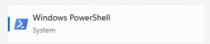
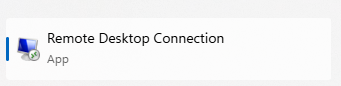

# Setting Up Raspberry Pi
File ini menjelaskan cara menghubungkan PC ke Raspberry Pi 4B dan menginisiasi program robot Hectarus


## AKSES RASPBERRY PI 4B HECTARUS

### Prerequisite:

1. Wifi Bengkel307 dan Bengkel303 tidak dilakukan perubahan (hapus address/ganti password). Jika dilakukan perubahan langsung ke bagian Setting Up Manual.
2. Pastikan terdapat OpenSSH Client (pada Windows, ceknya di System -> Optional Features) atau OpenSSH Server pada Ubuntu atau OpenSSH pada OS lainnya.
3. Pada Windows, diharapkan terdapat PowerShell (untuk menghubungkan terminal Windows dengan terminal Ubuntu Raspberry Pi 4B) dan/atau Remote Desktop Connection (Untuk wireless display monitor).




4. PC memiliki koneksi yang sama dengan Raspberry Pi Hectarus (jika poin nomor 1 terpenuhi, hubungkan PC pada Bengkel307).

### Step:

1. Pastikan Raspberry Pi 4B menyala
2. Pada Windows buka PowerShell atau terminal pada Ubuntu (ctrl + shift + t)
3. Ketik "ssh hectarus@192.168.7.118":
**Note: IP yang ditulis atau diberikan mungkin akan berubah. Jika gagal masuk, maka diperlukan aplikasi ketiga untuk mengecek IP Hectarus. Pada Android download aplikasi "Tether". Pastikan Android terhubung ke koneksi WiFi Bengkel307 atau Bengkel303 dan cari Hectarus desktop dan lihat IPnya. Gunakan IP tersebut.**
4. Setelah berhasil masuk, akan diminta password.
Password: hectarus123
5. Setelah berhasil, koneksi terminal wireless berhasil dilakukan

**CATATAN: Selalu update dan upgrade ketika mengaktifkan Raspberry Pi setiap harinya.**

Update & Upgrade sekaligus :
```ruby
sudo apt update && sudo apt full-upgrade -y
```
Jika jarang dilakukan update & upgrade, terkadang akan mempengaruhi program yang ada pada Raspberry Pi

### Remote Desktop Connection (Windows):

1. Selain menggunakan SSH, pada Windows bisa menggunakan Remote Desktop Connection untuk wireless display (menggunakan PC/Laptop sebagai monitor Hectarus secara wireless)
2. Buka Remote Desktop Connection dan masukkan IP Address koneksi WiFi Hectarus.
3. Akan terdapat panel atau windows yang muncul (jika address yang dimasukkan benar)
5. Masukkan ID/Username = hectarus, password = hectarus123
6. Jika username/password benar, window akan berubah menjadi dekstop Ubuntu Raspberry Pi.
**Catatan: Diperlukan koneksi WiFi yang stabil untuk membuat wireless display tidak lag**

### SETTING UP MANUAL:

1. Setting Up manual dilakukan jika Raspberry Pi 4B tidak terhubung pada koneksi WiFi manapuh sehingga sulit untuk dilakukan wireless display.
2. Siapkan monitor, kabel HDMI to micro HDMI, keyboard dan mouse
3. Buka penutup pada robot Hectarus.
4. Colokan kabel microHDMI pada Raspberry Pi dan setting up biasa seperti pada desktop pada umumnya.
5. Untuk bisa dilakukan wireless display, hubungkan wifi Raspberry Pi pada salah satu koneksi internet, bisa Bengkel atau hotspot. Penting untuk mengetahui IP Address koneksi internet Raspberry Pi untuk wireless display.
Password: hectarus123
6. Setelah Setting Up manual berhasil dilakukan, pastikan untuk menutup tutup robot Hectarus. Bisa dilem dengan lem tembak atau ditambahkan engsel.

### INISIASI PROGRAM PYTHON HECTARUS

Terdapat beberapa file yang bisa di-run.
1. Buka terminal Ubuntu Raspberry Pi, ctrl + shift + t (jika terhubung dengan Remote Desktop/secara manual)
2. Untuk melihat program program python yang terdapat pada robot Hectarus dapat dilihat dengan memasukan input "ls"
3. Tulisan berwarna biru merupakan file python. Untuk menginisasi ketik "python3 ...." dengan .... merupakan nama filenya (diikuti dengan extension .py)


### INISIASI PROGRAM PERGERAKAN HECTARUS DIATAS ARENA
1. Running program python Hectarus untuk berada dalam kondisi berdiri dengan
```ruby
python3 servo_langsung_berdiri2.py
```
2. Untuk memulai program robot Hectarus di atas arena, posisikan robot Hectarus diletakkan di atas arena di posisi start dengan tegak lurus kedepan
3. Pada powershell (Windows) atau terminal (Ubuntu), masukkan 
```ruby
ros2 launch hectarus_robot_controller all.launch.py
```
4. Tunggu sampai lampu LED indikator pada belakang robot Hectarus menyala hijau, tekan tombol hijau untuk memicu mulainya pergerakan robot Hectarus.
5. Untuk menghentikan program, gunakan ctrl + C.
6. Jika koneksi Powershell terputus, langsung matikan robot Hectarus pada saklar bagian belakang robot.

### Tips:
1. Untuk menulis suatu file atau program, bisa dengan menekan tab untuk shortcut penulisan. misalkan "python3 servo_la" + tab maka akan langsung tertulis "python3 servo_langsung_berdiri"
Contoh lain: "ros2 launch hec" + tab -> "ros2 launch hectarus_" + r + tab -> "ros2 launch hectarus_robot_controller" + a + tab -> "ros2 launch hectarus_robot_controller all.launch.py"
2. Untuk memulai program yang sudah diprogram sebelumnya, supaya tidak perlu mengetik ulang, tekan tombol arrow atas.
